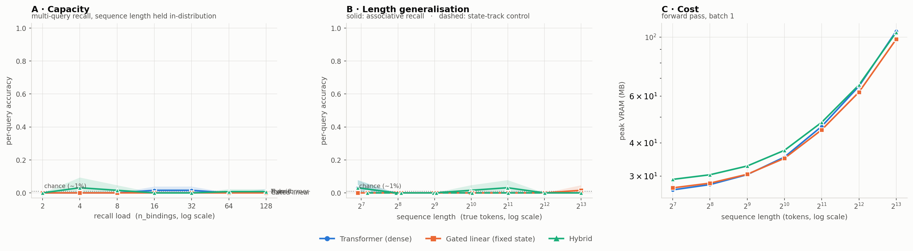

# iota run `r01-smoke`

- **updated:** 2026-09-30 03:02 UTC (last stage: `plot`)
- **code:** `7e1b8ef` on `claude/wonderful-ritchie-hbm5zn`
- **device:** Tesla T4 · torch 2.10.0+cu128 · Kaggle Batch

## 1. Training (best checkpoint, full-difficulty held-out set)

| model | best step | balanced | assoc (per-query) | state (control) | exact | lr | verdict |
|---|---:|---:|---:|---:|---:|---:|---|
| transformer | 60 | 0.003 | 0.006 | 0.000 | 0.016 | 0.0015 | ⚠ control at chance -- figure NOT trustworthy |
| gated_linear | 40 | 0.003 | 0.006 | 0.000 | 0.000 | 0.003 | ⚠ control at chance -- figure NOT trustworthy |
| hybrid | 60 | 0.009 | 0.018 | 0.000 | 0.031 | 0.0015 | ⚠ control at chance -- figure NOT trustworthy |

Healthy = assoc high **and** state well above chance (~0.01). Full per-eval curves are in `logs/train.log` and the `*_sweep.json` files.

## 1b. Sanity gate — each model on its own training distribution

| model | assoc per-query | assoc exact | state per-query | state exact | gate |
|---|---:|---:|---:|---:|---|
| hybrid | 0.000 | 0.000 | 0.000 | 0.000 | ⚠ FAIL — a task is at chance |
| transformer | 0.000 | 0.000 | 0.000 | 0.000 | ⚠ FAIL — a task is at chance |
| gated_linear | 0.000 | 0.000 | 0.000 | 0.000 | ⚠ FAIL — a task is at chance |

n=8 per mode. Both per-query columns must be well above chance (~0.01) before any sweep number means anything.

## 2. Pass 1 — capacity (the headline)

Per-query accuracy [95% CI], exact-all-queries in parentheses. n=8 per cell, paired prompts.

| n_bindings | true tokens | transformer | gated_linear | hybrid |
|---:|---:|---|---|---|
| 2 | 254 | 0.000 [0.00–0.00] (0.00) | 0.000 [0.00–0.00] (0.00) | 0.000 [0.00–0.00] (0.00) |
| 4 | 252 | 0.000 [0.00–0.00] (0.00) | 0.000 [0.00–0.00] (0.00) | 0.031 [0.00–0.09] (0.00) |
| 8 | 247 | 0.000 [0.00–0.00] (0.00) | 0.000 [0.00–0.00] (0.00) | 0.016 [0.00–0.05] (0.00) |
| 16 | 244 | 0.016 [0.00–0.04] (0.00) | 0.000 [0.00–0.00] (0.00) | 0.000 [0.00–0.00] (0.00) |
| 32 | 275 | 0.016 [0.00–0.04] (0.00) | 0.000 [0.00–0.00] (0.00) | 0.000 [0.00–0.00] (0.00) |
| 64 | 367 | 0.000 [0.00–0.00] (0.00) | 0.000 [0.00–0.00] (0.00) | 0.008 [0.00–0.02] (0.00) |
| 128 | 772 | 0.008 [0.00–0.02] (0.00) | 0.000 [0.00–0.00] (0.00) | 0.008 [0.00–0.02] (0.00) |

## 3. Pass 2 — length generalisation

Per-query accuracy [95% CI], exact-all-queries in parentheses. n=8 per cell, paired prompts.

| seq_len | true tokens | transformer | gated_linear | hybrid |
|---:|---:|---|---|---|
| 128 | 119 | 0.031 [0.00–0.08] (0.00) | 0.000 [0.00–0.00] (0.00) | 0.031 [0.00–0.08] (0.00) |
| 256 | 247 | 0.000 [0.00–0.00] (0.00) | 0.000 [0.00–0.00] (0.00) | 0.000 [0.00–0.00] (0.00) |
| 512 | 503 | 0.000 [0.00–0.00] (0.00) | 0.000 [0.00–0.00] (0.00) | 0.000 [0.00–0.00] (0.00) |
| 1024 | 1015 | 0.000 [0.00–0.00] (0.00) | 0.000 [0.00–0.00] (0.00) | 0.016 [0.00–0.05] (0.00) |
| 2048 | 2039 | 0.000 [0.00–0.00] (0.00) | 0.000 [0.00–0.00] (0.00) | 0.031 [0.00–0.08] (0.00) |
| 4096 | 4087 | 0.000 [0.00–0.00] (0.00) | 0.000 [0.00–0.00] (0.00) | 0.000 [0.00–0.00] (0.00) |
| 8192 | 8183 | 0.000 [0.00–0.00] (0.00) | 0.016 [0.00–0.05] (0.00) | 0.000 [0.00–0.00] (0.00) |

## 4. Pass 3 — state_track control

Per-query accuracy [95% CI], exact-all-queries in parentheses. n=8 per cell, paired prompts.

| seq_len | true tokens | transformer | gated_linear | hybrid |
|---:|---:|---|---|---|
| 128 | 144 | 0.000 [0.00–0.00] (0.00) | 0.000 [0.00–0.00] (0.00) | 0.000 [0.00–0.00] (0.00) |
| 256 | 272 | 0.000 [0.00–0.00] (0.00) | 0.000 [0.00–0.00] (0.00) | 0.000 [0.00–0.00] (0.00) |
| 512 | 528 | 0.000 [0.00–0.00] (0.00) | 0.000 [0.00–0.00] (0.00) | 0.000 [0.00–0.00] (0.00) |
| 1024 | 1040 | 0.000 [0.00–0.00] (0.00) | 0.000 [0.00–0.00] (0.00) | 0.000 [0.00–0.00] (0.00) |
| 2048 | 2064 | 0.000 [0.00–0.00] (0.00) | 0.000 [0.00–0.00] (0.00) | 0.000 [0.00–0.00] (0.00) |
| 4096 | 4112 | 0.000 [0.00–0.00] (0.00) | 0.000 [0.00–0.00] (0.00) | 0.000 [0.00–0.00] (0.00) |
| 8192 | 8208 | 0.000 [0.00–0.00] (0.00) | 0.000 [0.00–0.00] (0.00) | 0.000 [0.00–0.00] (0.00) |

## 5. Cost (forward pass, batch 1)

Peak VRAM MB / median latency ms.

| seq_len | transformer | gated_linear | hybrid |
|---:|---|---|---|
| 128 | 26.6 MB / 3.64 ms | 27.1 MB / 8.69 ms | 29.2 MB / 8.37 ms |
| 256 | 27.9 MB / 3.63 ms | 28.2 MB / 13.92 ms | 30.4 MB / 12.12 ms |
| 512 | 30.4 MB / 3.77 ms | 30.5 MB / 23.82 ms | 32.8 MB / 20.44 ms |
| 1024 | 35.4 MB / 6.46 ms | 35.0 MB / 43.31 ms | 37.5 MB / 34.67 ms |
| 2048 | 46.2 MB / 9.10 ms | 44.8 MB / 88.88 ms | 47.8 MB / 64.52 ms |
| 4096 | 65.4 MB / 23.04 ms | 62.1 MB / 163.00 ms | 66.1 MB / 131.30 ms |
| 8192 | 105.5 MB / 64.98 ms | 98.3 MB / 326.52 ms | 104.3 MB / 258.03 ms |

## 6. Figure

