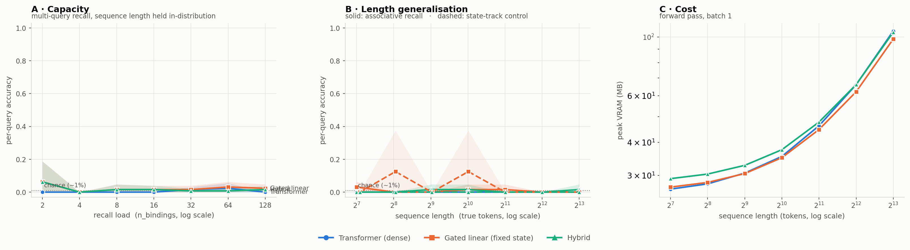

# iota run `r02-smoke`

- **updated:** 2026-10-01 02:56 UTC (last stage: `plot`)
- **code:** `d218e42` on `claude/wonderful-ritchie-hbm5zn`
- **device:** Tesla T4 · torch 2.10.0+cu128 · Kaggle Batch

## 0. LR probe (identical short budget per arch; pick each arch's best)

| arch | lr | best balanced | assoc | state | exact | best step | final balanced | time |
|---|---:|---:|---:|---:|---:|---:|---:|---:|
| transformer ★ | 0.00075 | 0.001 | 0.003 | 0.000 | 0.000 | 40 | 0.000 | 5s |
| gated_linear ★ | 0.00075 | 0.005 | 0.010 | 0.000 | 0.000 | 60 | 0.005 | 6s |
| hybrid ★ | 0.00075 | 0.005 | 0.010 | 0.000 | 0.000 | 40 | 0.005 | 5s |

4000 steps each, grad_clip 1.0. ★ = best lr for that arch.

## 1. Training (best checkpoint, full-difficulty held-out set)

| model | best step | balanced | assoc (per-query) | state (control) | exact | lr | verdict |
|---|---:|---:|---:|---:|---:|---:|---|
| transformer | 60 | 0.001 | 0.003 | 0.000 | 0.000 | 0.0015 | ⚠ control at chance -- figure NOT trustworthy |
| gated_linear | 60 | 0.032 | 0.013 | 0.050 | 0.016 | 0.003 | ⚠ recall at chance -- model never learned |
| hybrid | 60 | 0.028 | 0.005 | 0.050 | 0.016 | 0.0015 | ⚠ recall at chance -- model never learned |

Healthy = assoc high **and** state well above chance (~0.01). Full per-eval curves are in `logs/train.log` and the `*_sweep.json` files.

## 1b. Sanity gate — each model on its own training distribution

| model | assoc per-query | assoc exact | state per-query | state exact | gate |
|---|---:|---:|---:|---:|---|
| hybrid | 0.000 | 0.000 | 0.000 | 0.000 | ⚠ FAIL — a task is at chance |
| transformer | 0.000 | 0.000 | 0.000 | 0.000 | ⚠ FAIL — a task is at chance |
| gated_linear | 0.000 | 0.000 | 0.000 | 0.000 | ⚠ FAIL — a task is at chance |

n=8 per mode. Both per-query columns must be well above chance (~0.01) before any sweep number means anything.

## 2. Pass 1 — capacity (the headline)

Per-query accuracy [95% CI], exact-all-queries in parentheses. n=8 per cell, paired prompts.

| n_bindings | true tokens | transformer | gated_linear | hybrid |
|---:|---:|---|---|---|
| 2 | 256 | 0.000 [0.00–0.00] (0.00) | 0.062 [0.00–0.19] (0.00) | 0.062 [0.00–0.19] (0.00) |
| 4 | 256 | 0.000 [0.00–0.00] (0.00) | 0.000 [0.00–0.00] (0.00) | 0.000 [0.00–0.00] (0.00) |
| 8 | 256 | 0.000 [0.00–0.00] (0.00) | 0.016 [0.00–0.05] (0.00) | 0.016 [0.00–0.05] (0.00) |
| 16 | 256 | 0.000 [0.00–0.00] (0.00) | 0.016 [0.00–0.04] (0.00) | 0.016 [0.00–0.04] (0.00) |
| 32 | 290 | 0.016 [0.00–0.03] (0.00) | 0.016 [0.00–0.04] (0.00) | 0.008 [0.00–0.02] (0.00) |
| 64 | 384 | 0.023 [0.00–0.05] (0.00) | 0.031 [0.00–0.06] (0.00) | 0.008 [0.00–0.02] (0.00) |
| 128 | 774 | 0.000 [0.00–0.00] (0.00) | 0.023 [0.01–0.05] (0.00) | 0.016 [0.00–0.04] (0.00) |

## 3. Pass 2 — length generalisation

Per-query accuracy [95% CI], exact-all-queries in parentheses. n=8 per cell, paired prompts.

| seq_len | true tokens | transformer | gated_linear | hybrid |
|---:|---:|---|---|---|
| 128 | 128 | 0.000 [0.00–0.00] (0.00) | 0.031 [0.00–0.06] (0.00) | 0.000 [0.00–0.00] (0.00) |
| 256 | 256 | 0.000 [0.00–0.00] (0.00) | 0.000 [0.00–0.00] (0.00) | 0.000 [0.00–0.00] (0.00) |
| 512 | 513 | 0.000 [0.00–0.00] (0.00) | 0.000 [0.00–0.00] (0.00) | 0.016 [0.00–0.05] (0.00) |
| 1024 | 1025 | 0.000 [0.00–0.00] (0.00) | 0.016 [0.00–0.05] (0.00) | 0.016 [0.00–0.05] (0.00) |
| 2048 | 2048 | 0.000 [0.00–0.00] (0.00) | 0.016 [0.00–0.05] (0.00) | 0.000 [0.00–0.00] (0.00) |
| 4096 | 4096 | 0.000 [0.00–0.00] (0.00) | 0.000 [0.00–0.00] (0.00) | 0.000 [0.00–0.00] (0.00) |
| 8192 | 8192 | 0.000 [0.00–0.00] (0.00) | 0.000 [0.00–0.00] (0.00) | 0.016 [0.00–0.05] (0.00) |

## 4. Pass 3 — state_track control

Per-query accuracy [95% CI], exact-all-queries in parentheses. n=8 per cell, paired prompts.

| seq_len | true tokens | transformer | gated_linear | hybrid |
|---:|---:|---|---|---|
| 128 | 136 | 0.000 [0.00–0.00] (0.00) | 0.000 [0.00–0.00] (0.00) | 0.000 [0.00–0.00] (0.00) |
| 256 | 264 | 0.000 [0.00–0.00] (0.00) | 0.125 [0.00–0.38] (0.12) | 0.000 [0.00–0.00] (0.00) |
| 512 | 520 | 0.000 [0.00–0.00] (0.00) | 0.000 [0.00–0.00] (0.00) | 0.000 [0.00–0.00] (0.00) |
| 1024 | 1032 | 0.000 [0.00–0.00] (0.00) | 0.125 [0.00–0.38] (0.12) | 0.000 [0.00–0.00] (0.00) |
| 2048 | 2056 | 0.000 [0.00–0.00] (0.00) | 0.000 [0.00–0.00] (0.00) | 0.000 [0.00–0.00] (0.00) |
| 4096 | 4104 | 0.000 [0.00–0.00] (0.00) | 0.000 [0.00–0.00] (0.00) | 0.000 [0.00–0.00] (0.00) |
| 8192 | 8200 | 0.000 [0.00–0.00] (0.00) | 0.000 [0.00–0.00] (0.00) | 0.000 [0.00–0.00] (0.00) |

## 5. Cost (forward pass, batch 1)

Peak VRAM MB / median latency ms.

| seq_len | transformer | gated_linear | hybrid |
|---:|---|---|---|
| 128 | 26.6 MB / 3.51 ms | 27.1 MB / 8.54 ms | 29.2 MB / 7.77 ms |
| 256 | 27.9 MB / 3.34 ms | 28.2 MB / 13.25 ms | 30.4 MB / 11.52 ms |
| 512 | 30.6 MB / 3.31 ms | 30.5 MB / 22.55 ms | 32.8 MB / 19.12 ms |
| 1024 | 35.4 MB / 3.35 ms | 35.0 MB / 40.81 ms | 37.5 MB / 33.28 ms |
| 2048 | 46.2 MB / 7.89 ms | 44.7 MB / 77.95 ms | 47.7 MB / 63.59 ms |
| 4096 | 66.1 MB / 21.72 ms | 62.1 MB / 153.56 ms | 66.1 MB / 126.35 ms |
| 8192 | 105.5 MB / 67.45 ms | 98.3 MB / 308.74 ms | 104.3 MB / 243.62 ms |

## 6. Figure

