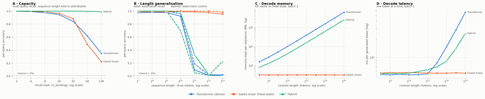

# iota run `r04`

- **updated:** 2026-10-07 00:43 UTC (last stage: `eval 8`)
- **code:** `4101680` on `claude/wonderful-ritchie-hbm5zn`
- **device:** Tesla T4 · torch 2.10.0+cu128 · Kaggle Batch

## 1. Training (best checkpoint, full-difficulty held-out set)

| model | best step | balanced | assoc (per-query) | state (control) | exact | lr | verdict |
|---|---:|---:|---:|---:|---:|---:|---|
| transformer | 14000 | 0.904 | 0.809 | 1.000 | 0.600 | 0.0015 | ok |
| gated_linear | 15000 | 0.916 | 0.839 | 0.994 | 0.634 | 0.0015 | ok |
| hybrid | 4500 | 1.000 | 1.000 | 1.000 | 1.000 | 0.00075 | ok |

Healthy = assoc high **and** state well above chance (~0.01). Full per-eval curves are in `logs/train.log` and the `*_sweep.json` files.

## 1b. Sanity gate — each model on its own training distribution

| model | assoc per-query | assoc exact | state per-query | state exact | gate |
|---|---:|---:|---:|---:|---|
| hybrid | 0.999 | 0.992 | 1.000 | 1.000 | pass |
| transformer | 0.809 | 0.380 | 1.000 | 1.000 | pass |
| gated_linear | 0.828 | 0.442 | 1.000 | 1.000 | pass |

n=500 per mode. Both per-query columns must be well above chance (~0.01) before any sweep number means anything.

## 2. Pass 1 — capacity (the headline)

Per-query accuracy [95% CI], exact-all-queries in parentheses. n=1000 per cell, paired prompts.

| n_bindings | true tokens | transformer | gated_linear | hybrid |
|---:|---:|---|---|---|
| 2 | 256 | 0.997 [0.99–1.00] (0.99) | 0.999 [1.00–1.00] (1.00) | 1.000 [1.00–1.00] (1.00) |
| 4 | 256 | 0.991 [0.99–0.99] (0.96) | 0.995 [0.99–1.00] (0.98) | 1.000 [1.00–1.00] (1.00) |
| 8 | 256 | 0.975 [0.97–0.98] (0.82) | 0.989 [0.99–0.99] (0.92) | 1.000 [1.00–1.00] (1.00) |
| 16 | 256 | 0.945 [0.94–0.95] (0.43) | 0.964 [0.96–0.97] (0.57) | 1.000 [1.00–1.00] (0.99) |
| 32 | 289 | 0.842 [0.84–0.85] (0.05) | 0.882 [0.88–0.89] (0.13) | 1.000 [1.00–1.00] (0.99) |
| 64 | 386 | 0.620 [0.61–0.63] (0.00) | 0.489 [0.48–0.50] (0.00) | 0.997 [1.00–1.00] (0.96) |
| 128 | 773 | 0.347 [0.34–0.35] (0.00) | 0.222 [0.22–0.23] (0.00) | 0.990 [0.99–0.99] (0.85) |

## 3. Pass 2 — length generalisation

Per-query accuracy [95% CI], exact-all-queries in parentheses. n=1000 per cell, paired prompts.

| seq_len | true tokens | transformer | gated_linear | hybrid |
|---:|---:|---|---|---|
| 128 | 128 | 0.975 [0.97–0.98] (0.82) | 0.988 [0.99–0.99] (0.91) | 1.000 [1.00–1.00] (1.00) |
| 256 | 256 | 0.978 [0.97–0.98] (0.84) | 0.989 [0.99–0.99] (0.92) | 1.000 [1.00–1.00] (1.00) |
| 512 | 512 | 0.977 [0.97–0.98] (0.83) | 0.987 [0.98–0.99] (0.90) | 1.000 [1.00–1.00] (1.00) |
| 1024 | 1024 | 0.923 [0.92–0.93] (0.55) | 0.989 [0.99–0.99] (0.92) | 0.987 [0.98–0.99] (0.90) |
| 2048 | 2048 | 0.096 [0.09–0.10] (0.00) | 0.987 [0.98–0.99] (0.90) | 0.331 [0.32–0.34] (0.00) |
| 4096 | 4096 | 0.011 [0.01–0.01] (0.00) | 0.977 [0.97–0.98] (0.83) | 0.023 [0.02–0.03] (0.00) |
| 8192 | 8192 | 0.010 [0.01–0.01] (0.00) | 0.954 [0.95–0.96] (0.69) | 0.013 [0.01–0.02] (0.00) |

## 4. Pass 3 — state_track control

Per-query accuracy [95% CI], exact-all-queries in parentheses. n=1000 per cell, paired prompts.

| seq_len | true tokens | transformer | gated_linear | hybrid |
|---:|---:|---|---|---|
| 128 | 136 | 1.000 [1.00–1.00] (1.00) | 1.000 [1.00–1.00] (1.00) | 1.000 [1.00–1.00] (1.00) |
| 256 | 264 | 1.000 [1.00–1.00] (1.00) | 1.000 [1.00–1.00] (1.00) | 1.000 [1.00–1.00] (1.00) |
| 512 | 520 | 1.000 [1.00–1.00] (1.00) | 1.000 [1.00–1.00] (1.00) | 1.000 [1.00–1.00] (1.00) |
| 1024 | 1032 | 0.955 [0.94–0.97] (0.95) | 1.000 [1.00–1.00] (1.00) | 0.701 [0.67–0.73] (0.70) |
| 2048 | 2056 | 0.189 [0.17–0.21] (0.19) | 1.000 [1.00–1.00] (1.00) | 0.052 [0.04–0.07] (0.05) |
| 4096 | 4104 | 0.017 [0.01–0.03] (0.02) | 0.999 [1.00–1.00] (1.00) | 0.011 [0.01–0.02] (0.01) |
| 8192 | 8200 | 0.020 [0.01–0.03] (0.02) | 0.984 [0.98–0.99] (0.98) | 0.226 [0.20–0.25] (0.23) |

## 4b. Diagnostic — recall by key length (digits), same prompts as Pass 1

| n_bindings | key digits | transformer | gated_linear | hybrid |
|---:|---:|---:|---:|---:|
| 16 | 1 | 0.948 | 0.974 | 1.000 |
| 16 | 2 | 0.952 | 0.960 | 1.000 |
| 16 | 3 | 0.920 | 0.974 | 0.998 |
| 32 | 1 | 0.874 | 0.918 | 0.999 |
| 32 | 2 | 0.848 | 0.871 | 1.000 |
| 32 | 3 | 0.808 | 0.904 | 0.998 |
| 64 | 1 | 0.674 | 0.620 | 0.997 |
| 64 | 2 | 0.638 | 0.455 | 0.997 |
| 64 | 3 | 0.545 | 0.554 | 0.997 |

If one model's errors pile up on 3-digit keys, its drop with load is partly key resolution, not memory capacity.

## 4c. Joint load × distance grid (8 queries per cell; true length held per column)

**transformer** — per-query recall

| bindings \ tokens | 1024 | 2048 | 4096 | 8192 |
|---:|---:|---:|---:|---:|
| 8 | 0.924 | 0.096 | 0.011 | 0.008 |
| 32 | 0.742 | 0.059 | 0.010 | 0.008 |
| 64 | 0.548 | 0.053 | 0.014 | 0.010 |
| 128 | 0.342 | 0.082 | 0.013 | 0.010 |

**gated_linear** — per-query recall

| bindings \ tokens | 1024 | 2048 | 4096 | 8192 |
|---:|---:|---:|---:|---:|
| 8 | 0.988 | 0.988 | 0.979 | 0.957 |
| 32 | 0.875 | 0.875 | 0.850 | 0.818 |
| 64 | 0.658 | 0.651 | 0.652 | 0.612 |
| 128 | 0.337 | 0.331 | 0.317 | 0.313 |

**hybrid** — per-query recall

| bindings \ tokens | 1024 | 2048 | 4096 | 8192 |
|---:|---:|---:|---:|---:|
| 8 | 0.988 | 0.336 | 0.023 | 0.015 |
| 32 | 0.970 | 0.204 | 0.013 | 0.009 |
| 64 | 0.919 | 0.166 | 0.013 | 0.007 |
| 128 | 0.894 | 0.232 | 0.013 | 0.008 |

## 4d. Free-running vs teacher-forced (Pass 1 prompts)

Per-query recall: teacher-forced → free-running (queries whose verdict changed).

| n_bindings | transformer | gated_linear | hybrid |
|---:|---|---|---|
| 2 | 0.997 → 0.994 (3) | 0.998 → 0.996 (2) | 1.000 → 1.000 (0) |
| 4 | 0.993 → 0.988 (10) | 0.995 → 0.992 (7) | 0.999 → 0.999 (0) |
| 8 | 0.973 → 0.954 (78) | 0.989 → 0.985 (17) | 1.000 → 1.000 (0) |
| 16 | 0.946 → 0.911 (311) | 0.966 → 0.958 (76) | 0.999 → 0.999 (0) |
| 32 | 0.848 → 0.823 (348) | 0.883 → 0.871 (161) | 1.000 → 1.000 (0) |
| 64 | 0.618 → 0.599 (548) | 0.491 → 0.492 (379) | 0.998 → 0.998 (0) |
| 128 | 0.347 → 0.340 (517) | 0.217 → 0.224 (332) | 0.991 → 0.991 (3) |

## 4e. Matched histories (Pass 7): does answering earlier questions change later recall?

Same facts, same final question at the same position; only the history differs. Final-query accuracy; Δ = condition − oracle (paired, 95% CI over items).

| model | bindings | prior Qs | none / oracle | neutral (Δ) | generated (Δ) | reordered (Δ) |
|---|---:|---:|---:|---|---|---|
| transformer | 8 | 0 | 0.950 | – | – | – |
| transformer | 8 | 3 | 0.968 | 0.958 (-0.010 [-0.02, 0.00]) | 0.962 (-0.006 [-0.01, 0.00]) | 0.968 (+0.000 [0.00, 0.00]) |
| transformer | 8 | 7 | 0.994 | 0.960 (-0.034 [-0.05, -0.02]) | 0.968 (-0.026 [-0.04, -0.01]) | 0.994 (+0.000 [0.00, 0.00]) |
| transformer | 32 | 0 | 0.810 | – | – | – |
| transformer | 32 | 3 | 0.840 | 0.810 (-0.030 [-0.05, -0.01]) | 0.830 (-0.010 [-0.02, 0.00]) | 0.840 (+0.000 [-0.01, 0.01]) |
| transformer | 32 | 7 | 0.864 | 0.834 (-0.030 [-0.05, -0.01]) | 0.846 (-0.018 [-0.03, -0.00]) | 0.864 (+0.000 [-0.01, 0.01]) |
| transformer | 32 | 15 | 0.872 | 0.818 (-0.054 [-0.08, -0.03]) | 0.830 (-0.042 [-0.07, -0.02]) | 0.860 (-0.012 [-0.02, -0.00]) |
| transformer | 64 | 0 | 0.622 | – | – | – |
| transformer | 64 | 3 | 0.628 | 0.632 (+0.004 [-0.01, 0.02]) | 0.622 (-0.006 [-0.02, 0.01]) | 0.636 (+0.008 [0.00, 0.02]) |
| transformer | 64 | 7 | 0.684 | 0.664 (-0.020 [-0.05, 0.00]) | 0.674 (-0.010 [-0.03, 0.01]) | 0.672 (-0.012 [-0.03, 0.00]) |
| transformer | 64 | 15 | 0.676 | 0.676 (+0.000 [-0.03, 0.03]) | 0.638 (-0.038 [-0.07, -0.01]) | 0.674 (-0.002 [-0.02, 0.01]) |
| gated_linear | 8 | 0 | 0.984 | – | – | – |
| gated_linear | 8 | 3 | 0.988 | 0.978 (-0.010 [-0.02, 0.00]) | 0.982 (-0.006 [-0.01, 0.00]) | 0.988 (+0.000 [-0.01, 0.01]) |
| gated_linear | 8 | 7 | 1.000 | 0.990 (-0.010 [-0.02, -0.00]) | 0.992 (-0.008 [-0.02, -0.00]) | 1.000 (+0.000 [0.00, 0.00]) |
| gated_linear | 32 | 0 | 0.862 | – | – | – |
| gated_linear | 32 | 3 | 0.866 | 0.864 (-0.002 [-0.02, 0.01]) | 0.862 (-0.004 [-0.01, 0.00]) | 0.862 (-0.004 [-0.02, 0.01]) |
| gated_linear | 32 | 7 | 0.906 | 0.886 (-0.020 [-0.04, 0.00]) | 0.892 (-0.014 [-0.03, -0.00]) | 0.902 (-0.004 [-0.01, 0.00]) |
| gated_linear | 32 | 15 | 0.908 | 0.876 (-0.032 [-0.06, -0.01]) | 0.886 (-0.022 [-0.04, -0.01]) | 0.918 (+0.010 [0.00, 0.02]) |
| gated_linear | 64 | 0 | 0.672 | – | – | – |
| gated_linear | 64 | 3 | 0.646 | 0.632 (-0.014 [-0.03, 0.00]) | 0.650 (+0.004 [-0.01, 0.02]) | 0.650 (+0.004 [-0.01, 0.02]) |
| gated_linear | 64 | 7 | 0.686 | 0.688 (+0.002 [-0.02, 0.02]) | 0.690 (+0.004 [-0.01, 0.02]) | 0.680 (-0.006 [-0.02, 0.01]) |
| gated_linear | 64 | 15 | 0.680 | 0.646 (-0.034 [-0.06, -0.01]) | 0.662 (-0.018 [-0.04, 0.00]) | 0.674 (-0.006 [-0.02, 0.01]) |
| hybrid | 8 | 0 | 1.000 | – | – | – |
| hybrid | 8 | 3 | 1.000 | 1.000 (+0.000 [0.00, 0.00]) | 1.000 (+0.000 [0.00, 0.00]) | 1.000 (+0.000 [0.00, 0.00]) |
| hybrid | 8 | 7 | 0.998 | 0.998 (+0.000 [0.00, 0.00]) | 0.998 (+0.000 [0.00, 0.00]) | 0.998 (+0.000 [0.00, 0.00]) |
| hybrid | 32 | 0 | 0.998 | – | – | – |
| hybrid | 32 | 3 | 1.000 | 1.000 (+0.000 [0.00, 0.00]) | 1.000 (+0.000 [0.00, 0.00]) | 1.000 (+0.000 [0.00, 0.00]) |
| hybrid | 32 | 7 | 1.000 | 1.000 (+0.000 [0.00, 0.00]) | 1.000 (+0.000 [0.00, 0.00]) | 1.000 (+0.000 [0.00, 0.00]) |
| hybrid | 32 | 15 | 1.000 | 1.000 (+0.000 [0.00, 0.00]) | 1.000 (+0.000 [0.00, 0.00]) | 1.000 (+0.000 [0.00, 0.00]) |
| hybrid | 64 | 0 | 1.000 | – | – | – |
| hybrid | 64 | 3 | 1.000 | 1.000 (+0.000 [0.00, 0.00]) | 1.000 (+0.000 [0.00, 0.00]) | 1.000 (+0.000 [0.00, 0.00]) |
| hybrid | 64 | 7 | 1.000 | 1.000 (+0.000 [0.00, 0.00]) | 1.000 (+0.000 [0.00, 0.00]) | 1.000 (+0.000 [0.00, 0.00]) |
| hybrid | 64 | 15 | 1.000 | 1.000 (+0.000 [0.00, 0.00]) | 1.000 (+0.000 [0.00, 0.00]) | 1.000 (+0.000 [0.00, 0.00]) |

Positive neutral Δ = the correctly answered history HURTS the final recall relative to equally long filler.

## 4f. Decay gates (Pass 8): what γ does on real prompts

Mean γ ± std over tokens × heads, by token role. `retention` = mean log10 of the share of a fact value's write still in the state at the first question. A frozen gate has std ≈ 0; selective forgetting shows as γ(distractor) < γ(fact value).

| model | bindings | layer | fact value | distractor | query | answer | retention (log10) | gate bias / ‖W‖ |
|---|---:|---|---|---|---|---|---:|---|
| gated_linear | 8 | backbone.blocks.0.mixer | 0.399 ± 0.340 | 0.281 ± 0.207 | 0.283 ± 0.236 | 0.396 ± 0.336 | -161.823 | -0.04 / 1.321 |
| gated_linear | 8 | backbone.blocks.1.mixer | 1.000 ± 0.000 | 0.929 ± 0.144 | 1.000 ± 0.001 | 1.000 ± 0.000 | -8.109 | +0.18 / 2.490 |
| gated_linear | 8 | backbone.blocks.2.mixer | 1.000 ± 0.000 | 1.000 ± 0.000 | 1.000 ± 0.000 | 1.000 ± 0.000 | -0.001 | +0.12 / 2.420 |
| gated_linear | 8 | backbone.blocks.3.mixer | 0.997 ± 0.007 | 0.902 ± 0.109 | 0.999 ± 0.002 | 1.000 ± 0.001 | -10.029 | +0.10 / 2.496 |
| gated_linear | 8 | backbone.blocks.4.mixer | 1.000 ± 0.000 | 1.000 ± 0.000 | 1.000 ± 0.000 | 1.000 ± 0.001 | -0.002 | +0.07 / 2.014 |
| gated_linear | 32 | backbone.blocks.0.mixer | 0.399 ± 0.340 | 0.281 ± 0.208 | 0.284 ± 0.235 | 0.396 ± 0.335 | -141.066 | -0.04 / 1.321 |
| gated_linear | 32 | backbone.blocks.1.mixer | 1.000 ± 0.000 | 0.931 ± 0.143 | 1.000 ± 0.000 | 1.000 ± 0.000 | -3.655 | +0.18 / 2.490 |
| gated_linear | 32 | backbone.blocks.2.mixer | 1.000 ± 0.000 | 1.000 ± 0.000 | 1.000 ± 0.000 | 1.000 ± 0.000 | -0.002 | +0.12 / 2.420 |
| gated_linear | 32 | backbone.blocks.3.mixer | 0.997 ± 0.006 | 0.919 ± 0.095 | 1.000 ± 0.001 | 1.000 ± 0.000 | -3.837 | +0.10 / 2.496 |
| gated_linear | 32 | backbone.blocks.4.mixer | 1.000 ± 0.000 | 1.000 ± 0.000 | 1.000 ± 0.000 | 1.000 ± 0.000 | -0.006 | +0.07 / 2.014 |
| hybrid | 8 | backbone.blocks.0.mixer | 0.311 ± 0.250 | 0.119 ± 0.082 | 0.118 ± 0.166 | 0.307 ± 0.247 | -231.714 | -0.10 / 0.921 |
| hybrid | 8 | backbone.blocks.1.mixer | 0.182 ± 0.265 | 0.973 ± 0.072 | 0.901 ± 0.139 | 0.754 ± 0.240 | -21.129 | +0.04 / 1.451 |
| hybrid | 8 | backbone.blocks.3.mixer | 0.711 ± 0.204 | 0.698 ± 0.215 | 0.735 ± 0.231 | 0.728 ± 0.227 | -41.776 | +0.05 / 0.783 |
| hybrid | 32 | backbone.blocks.0.mixer | 0.311 ± 0.251 | 0.119 ± 0.083 | 0.118 ± 0.166 | 0.306 ± 0.247 | -188.957 | -0.10 / 0.921 |
| hybrid | 32 | backbone.blocks.1.mixer | 0.179 ± 0.261 | 0.966 ± 0.098 | 0.898 ± 0.139 | 0.746 ± 0.240 | -79.871 | +0.04 / 1.451 |
| hybrid | 32 | backbone.blocks.3.mixer | 0.709 ± 0.203 | 0.699 ± 0.210 | 0.729 ± 0.231 | 0.724 ± 0.220 | -33.009 | +0.05 / 0.783 |

## 5. Prefill cost (one forward pass, batch 1; mostly kernel quality)

Peak VRAM MB / median latency ms.

| seq_len | transformer | gated_linear | hybrid |
|---:|---|---|---|
| 128 | 20.7 MB / 5.28 ms | 21.0 MB / 11.52 ms | 21.1 MB / 8.98 ms |
| 256 | 22.1 MB / 5.01 ms | 22.1 MB / 18.11 ms | 22.3 MB / 12.95 ms |
| 512 | 24.9 MB / 5.62 ms | 24.4 MB / 33.69 ms | 24.6 MB / 20.94 ms |
| 1024 | 30.6 MB / 8.85 ms | 28.9 MB / 56.42 ms | 29.8 MB / 36.93 ms |
| 2048 | 41.8 MB / 11.03 ms | 38.0 MB / 115.23 ms | 40.3 MB / 69.76 ms |
| 4096 | 64.3 MB / 29.61 ms | 56.0 MB / 212.75 ms | 61.3 MB / 135.96 ms |
| 8192 | 109.3 MB / 89.31 ms | 92.2 MB / 424.22 ms | 103.4 MB / 270.11 ms |

## 5b. Decode cost (one token at a time, batch 1)

Memory each model keeps per sequence (exact cache/state size) / median ms per token.

| context | transformer | gated_linear | hybrid |
|---:|---|---|---|
| 128 | 1.61 MB / 5.23 ms | 0.33 MB / 5.53 ms | 0.84 MB / 5.42 ms |
| 256 | 2.86 MB / 5.16 ms | 0.33 MB / 5.63 ms | 1.34 MB / 5.45 ms |
| 512 | 5.36 MB / 5.23 ms | 0.33 MB / 5.59 ms | 2.34 MB / 5.40 ms |
| 1024 | 10.36 MB / 5.18 ms | 0.33 MB / 5.64 ms | 4.34 MB / 5.49 ms |
| 2048 | 20.36 MB / 5.20 ms | 0.33 MB / 5.59 ms | 8.34 MB / 5.88 ms |
| 4096 | 40.36 MB / 5.36 ms | 0.33 MB / 5.54 ms | 16.34 MB / 6.30 ms |
| 8192 | 80.36 MB / 8.20 ms | 0.33 MB / 5.51 ms | 32.34 MB / 7.03 ms |
| 16384 | 160.36 MB / 15.05 ms | 0.33 MB / 5.52 ms | 64.34 MB / 8.74 ms |
| 32768 | 320.36 MB / 28.73 ms | 0.33 MB / 5.57 ms | 128.34 MB / 14.16 ms |
| 65536 | 640.36 MB / 56.20 ms | 0.33 MB / 5.51 ms | 256.34 MB / 25.19 ms |

## 6. Figure

