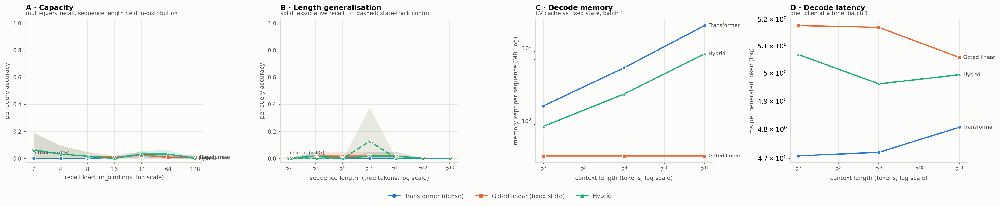

# iota run `r05-smoke`

- **updated:** 2026-10-04 06:26 UTC (last stage: `plot`)
- **code:** `e713514` on `main`
- **device:** Tesla T4 · torch 2.10.0+cu128 · Kaggle Batch

## 0. LR probe (identical short budget per arch; pick each arch's best)

| arch | lr | best balanced | assoc | state | exact | best step | final balanced | time |
|---|---:|---:|---:|---:|---:|---:|---:|---:|
| transformer ★ | 0.00075 | 0.006 | 0.013 | 0.000 | 0.000 | 60 | 0.006 | 5s |
| gated_linear ★ | 0.00075 | 0.005 | 0.010 | 0.000 | 0.000 | 40 | 0.004 | 7s |
| hybrid ★ | 0.00075 | 0.006 | 0.013 | 0.000 | 0.000 | 60 | 0.006 | 6s |

4000 steps each, grad_clip 1.0. ★ = best lr for that arch.

## 1. Training (best checkpoint, full-difficulty held-out set)

| model | best step | balanced | assoc (per-query) | state (control) | exact | lr | verdict |
|---|---:|---:|---:|---:|---:|---:|---|
| transformer | 60 | 0.006 | 0.013 | 0.000 | 0.000 | 0.0015 | ⚠ control at chance -- figure NOT trustworthy |
| gated_linear | 60 | 0.006 | 0.013 | 0.000 | 0.000 | 0.0015 | ⚠ control at chance -- figure NOT trustworthy |
| hybrid | 60 | 0.006 | 0.013 | 0.000 | 0.000 | 0.00075 | ⚠ control at chance -- figure NOT trustworthy |

Healthy = assoc high **and** state well above chance (~0.01). Full per-eval curves are in `logs/train.log` and the `*_sweep.json` files.

## 1b. Sanity gate — each model on its own training distribution

| model | assoc per-query | assoc exact | state per-query | state exact | gate |
|---|---:|---:|---:|---:|---|
| hybrid | 0.000 | 0.000 | 0.000 | 0.000 | ⚠ FAIL — a task is at chance |
| transformer | 0.018 | 0.000 | 0.000 | 0.000 | ⚠ FAIL — a task is at chance |
| gated_linear | 0.018 | 0.000 | 0.000 | 0.000 | ⚠ FAIL — a task is at chance |

n=8 per mode. Both per-query columns must be well above chance (~0.01) before any sweep number means anything.

## 2. Pass 1 — capacity (the headline)

Per-query accuracy [95% CI], exact-all-queries in parentheses. n=8 per cell, paired prompts.

| n_bindings | true tokens | transformer | gated_linear | hybrid |
|---:|---:|---|---|---|
| 2 | 256 | 0.000 [0.00–0.00] (0.00) | 0.062 [0.00–0.19] (0.00) | 0.062 [0.00–0.19] (0.00) |
| 4 | 256 | 0.000 [0.00–0.00] (0.00) | 0.031 [0.00–0.09] (0.00) | 0.031 [0.00–0.09] (0.00) |
| 8 | 256 | 0.000 [0.00–0.00] (0.00) | 0.016 [0.00–0.05] (0.00) | 0.016 [0.00–0.05] (0.00) |
| 16 | 256 | 0.008 [0.00–0.02] (0.00) | 0.008 [0.00–0.02] (0.00) | 0.000 [0.00–0.00] (0.00) |
| 32 | 290 | 0.023 [0.01–0.05] (0.00) | 0.023 [0.01–0.05] (0.00) | 0.031 [0.01–0.05] (0.00) |
| 64 | 384 | 0.008 [0.00–0.02] (0.00) | 0.008 [0.00–0.02] (0.00) | 0.031 [0.00–0.06] (0.00) |
| 128 | 774 | 0.008 [0.00–0.02] (0.00) | 0.008 [0.00–0.02] (0.00) | 0.000 [0.00–0.00] (0.00) |

## 3. Pass 2 — length generalisation

Per-query accuracy [95% CI], exact-all-queries in parentheses. n=8 per cell, paired prompts.

| seq_len | true tokens | transformer | gated_linear | hybrid |
|---:|---:|---|---|---|
| 128 | 128 | 0.000 [0.00–0.00] (0.00) | 0.000 [0.00–0.00] (0.00) | 0.000 [0.00–0.00] (0.00) |
| 256 | 256 | 0.016 [0.00–0.05] (0.00) | 0.016 [0.00–0.05] (0.00) | 0.016 [0.00–0.05] (0.00) |
| 512 | 513 | 0.000 [0.00–0.00] (0.00) | 0.016 [0.00–0.05] (0.00) | 0.000 [0.00–0.00] (0.00) |
| 1024 | 1025 | 0.000 [0.00–0.00] (0.00) | 0.016 [0.00–0.05] (0.00) | 0.016 [0.00–0.05] (0.00) |
| 2048 | 2048 | 0.000 [0.00–0.00] (0.00) | 0.016 [0.00–0.05] (0.00) | 0.016 [0.00–0.05] (0.00) |
| 4096 | 4096 | 0.000 [0.00–0.00] (0.00) | 0.000 [0.00–0.00] (0.00) | 0.000 [0.00–0.00] (0.00) |
| 8192 | 8192 | 0.000 [0.00–0.00] (0.00) | 0.000 [0.00–0.00] (0.00) | 0.000 [0.00–0.00] (0.00) |

## 4. Pass 3 — state_track control

Per-query accuracy [95% CI], exact-all-queries in parentheses. n=8 per cell, paired prompts.

| seq_len | true tokens | transformer | gated_linear | hybrid |
|---:|---:|---|---|---|
| 128 | 136 | 0.000 [0.00–0.00] (0.00) | 0.000 [0.00–0.00] (0.00) | 0.000 [0.00–0.00] (0.00) |
| 256 | 264 | 0.000 [0.00–0.00] (0.00) | 0.000 [0.00–0.00] (0.00) | 0.000 [0.00–0.00] (0.00) |
| 512 | 520 | 0.000 [0.00–0.00] (0.00) | 0.000 [0.00–0.00] (0.00) | 0.000 [0.00–0.00] (0.00) |
| 1024 | 1032 | 0.000 [0.00–0.00] (0.00) | 0.125 [0.00–0.38] (0.12) | 0.125 [0.00–0.38] (0.12) |
| 2048 | 2056 | 0.000 [0.00–0.00] (0.00) | 0.000 [0.00–0.00] (0.00) | 0.000 [0.00–0.00] (0.00) |
| 4096 | 4104 | 0.000 [0.00–0.00] (0.00) | 0.000 [0.00–0.00] (0.00) | 0.000 [0.00–0.00] (0.00) |
| 8192 | 8200 | 0.000 [0.00–0.00] (0.00) | 0.000 [0.00–0.00] (0.00) | 0.000 [0.00–0.00] (0.00) |

## 4b. Diagnostic — recall by key length (digits), same prompts as Pass 1

| n_bindings | key digits | transformer | gated_linear | hybrid |
|---:|---:|---:|---:|---:|
| 16 | 1 | 0.000 | 0.000 | 0.000 |
| 16 | 2 | 0.010 | 0.010 | 0.000 |
| 16 | 3 | 0.000 | 0.000 | 0.000 |
| 32 | 1 | 0.000 | 0.000 | 0.000 |
| 32 | 2 | 0.031 | 0.031 | 0.042 |
| 32 | 3 | 0.000 | 0.000 | 0.000 |
| 64 | 1 | 0.000 | 0.000 | 0.000 |
| 64 | 2 | 0.000 | 0.000 | 0.044 |
| 64 | 3 | 0.040 | 0.040 | 0.000 |

If one model's errors pile up on 3-digit keys, its drop with load is partly key resolution, not memory capacity.

## 5. Prefill cost (one forward pass, batch 1; mostly kernel quality)

Peak VRAM MB / median latency ms.

| seq_len | transformer | gated_linear | hybrid |
|---:|---|---|---|
| 128 | 28.8 MB / 4.60 ms | 29.1 MB / 11.30 ms | 29.2 MB / 8.48 ms |
| 256 | 30.2 MB / 4.88 ms | 30.3 MB / 16.32 ms | 30.4 MB / 11.95 ms |
| 512 | 33.3 MB / 4.90 ms | 32.5 MB / 29.42 ms | 32.9 MB / 19.81 ms |
| 1024 | 38.7 MB / 5.78 ms | 37.0 MB / 53.94 ms | 37.9 MB / 37.33 ms |
| 2048 | 50.7 MB / 12.45 ms | 46.9 MB / 98.32 ms | 49.2 MB / 62.52 ms |
| 4096 | 72.5 MB / 26.26 ms | 64.2 MB / 193.69 ms | 69.5 MB / 125.60 ms |
| 8192 | 117.5 MB / 80.21 ms | 100.3 MB / 391.76 ms | 111.5 MB / 249.59 ms |

## 5b. Decode cost (one token at a time, batch 1)

Memory each model keeps per sequence (exact cache/state size) / median ms per token.

| context | transformer | gated_linear | hybrid |
|---:|---|---|---|
| 128 | 1.61 MB / 4.71 ms | 0.33 MB / 5.18 ms | 0.84 MB / 5.07 ms |
| 512 | 5.36 MB / 4.72 ms | 0.33 MB / 5.17 ms | 2.34 MB / 4.96 ms |
| 2048 | 20.36 MB / 4.81 ms | 0.33 MB / 5.06 ms | 8.34 MB / 4.99 ms |

## 6. Figure

