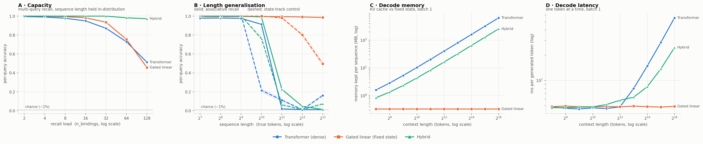

# iota run `r05`

- **updated:** 2026-10-05 21:40 UTC (last stage: `eval 5,6`)
- **code:** `28c0e1e` on `claude/wonderful-ritchie-hbm5zn`
- **device:** Tesla T4 · torch 2.10.0+cu128 · Kaggle Batch

## 1. Training (best checkpoint, full-difficulty held-out set)

| model | best step | balanced | assoc (per-query) | state (control) | exact | lr | verdict |
|---|---:|---:|---:|---:|---:|---:|---|
| transformer | 12500 | 0.926 | 0.853 | 1.000 | 0.618 | 0.0015 | ok |
| gated_linear | 15000 | 0.957 | 0.913 | 1.000 | 0.742 | 0.0015 | ok |
| hybrid | 4000 | 1.000 | 1.000 | 1.000 | 1.000 | 0.00075 | ok |

Healthy = assoc high **and** state well above chance (~0.01). Full per-eval curves are in `logs/train.log` and the `*_sweep.json` files.

## 1b. Sanity gate — each model on its own training distribution

| model | assoc per-query | assoc exact | state per-query | state exact | gate |
|---|---:|---:|---:|---:|---|
| hybrid | 1.000 | 0.998 | 1.000 | 1.000 | pass |
| transformer | 0.849 | 0.420 | 1.000 | 1.000 | pass |
| gated_linear | 0.900 | 0.580 | 1.000 | 1.000 | pass |

n=500 per mode. Both per-query columns must be well above chance (~0.01) before any sweep number means anything.

## 2. Pass 1 — capacity (the headline)

Per-query accuracy [95% CI], exact-all-queries in parentheses. n=1000 per cell, paired prompts.

| n_bindings | true tokens | transformer | gated_linear | hybrid |
|---:|---:|---|---|---|
| 2 | 256 | 0.996 [0.99–1.00] (0.99) | 1.000 [1.00–1.00] (1.00) | 1.000 [1.00–1.00] (1.00) |
| 4 | 256 | 0.990 [0.99–0.99] (0.96) | 0.998 [1.00–1.00] (0.99) | 1.000 [1.00–1.00] (1.00) |
| 8 | 256 | 0.978 [0.97–0.98] (0.83) | 0.994 [0.99–1.00] (0.96) | 1.000 [1.00–1.00] (1.00) |
| 16 | 256 | 0.949 [0.95–0.95] (0.42) | 0.983 [0.98–0.98] (0.77) | 1.000 [1.00–1.00] (1.00) |
| 32 | 289 | 0.871 [0.87–0.88] (0.10) | 0.935 [0.93–0.94] (0.36) | 1.000 [1.00–1.00] (1.00) |
| 64 | 386 | 0.728 [0.72–0.74] (0.00) | 0.754 [0.75–0.76] (0.00) | 0.982 [0.98–0.98] (0.72) |
| 128 | 773 | 0.512 [0.50–0.52] (0.00) | 0.456 [0.45–0.46] (0.00) | 0.973 [0.97–0.98] (0.65) |

## 3. Pass 2 — length generalisation

Per-query accuracy [95% CI], exact-all-queries in parentheses. n=1000 per cell, paired prompts.

| seq_len | true tokens | transformer | gated_linear | hybrid |
|---:|---:|---|---|---|
| 128 | 128 | 0.978 [0.97–0.98] (0.83) | 0.996 [0.99–1.00] (0.97) | 1.000 [1.00–1.00] (1.00) |
| 256 | 256 | 0.980 [0.98–0.98] (0.85) | 0.995 [0.99–1.00] (0.96) | 1.000 [1.00–1.00] (1.00) |
| 512 | 512 | 0.977 [0.97–0.98] (0.83) | 0.996 [0.99–1.00] (0.97) | 1.000 [1.00–1.00] (1.00) |
| 1024 | 1024 | 0.913 [0.91–0.92] (0.51) | 0.994 [0.99–1.00] (0.96) | 0.992 [0.99–0.99] (0.94) |
| 2048 | 2048 | 0.019 [0.02–0.02] (0.00) | 0.994 [0.99–1.00] (0.96) | 0.226 [0.22–0.23] (0.00) |
| 4096 | 4096 | 0.011 [0.01–0.01] (0.00) | 0.991 [0.99–0.99] (0.93) | 0.046 [0.04–0.05] (0.00) |
| 8192 | 8192 | 0.011 [0.01–0.01] (0.00) | 0.986 [0.98–0.99] (0.90) | 0.013 [0.01–0.02] (0.00) |

## 4. Pass 3 — state_track control

Per-query accuracy [95% CI], exact-all-queries in parentheses. n=1000 per cell, paired prompts.

| seq_len | true tokens | transformer | gated_linear | hybrid |
|---:|---:|---|---|---|
| 128 | 136 | 1.000 [1.00–1.00] (1.00) | 1.000 [1.00–1.00] (1.00) | 0.998 [0.99–1.00] (1.00) |
| 256 | 264 | 1.000 [1.00–1.00] (1.00) | 1.000 [1.00–1.00] (1.00) | 1.000 [1.00–1.00] (1.00) |
| 512 | 520 | 1.000 [1.00–1.00] (1.00) | 1.000 [1.00–1.00] (1.00) | 0.999 [1.00–1.00] (1.00) |
| 1024 | 1032 | 0.214 [0.19–0.24] (0.21) | 1.000 [1.00–1.00] (1.00) | 0.760 [0.73–0.79] (0.76) |
| 2048 | 2056 | 0.111 [0.09–0.13] (0.11) | 0.981 [0.97–0.99] (0.98) | 0.062 [0.05–0.08] (0.06) |
| 4096 | 4104 | 0.011 [0.01–0.02] (0.01) | 0.802 [0.78–0.83] (0.80) | 0.011 [0.01–0.02] (0.01) |
| 8192 | 8200 | 0.161 [0.14–0.18] (0.16) | 0.495 [0.47–0.53] (0.49) | 0.072 [0.06–0.09] (0.07) |

## 4b. Diagnostic — recall by key length (digits), same prompts as Pass 1

| n_bindings | key digits | transformer | gated_linear | hybrid |
|---:|---:|---:|---:|---:|
| 16 | 1 | 0.954 | 0.991 | 1.000 |
| 16 | 2 | 0.953 | 0.980 | 1.000 |
| 16 | 3 | 0.937 | 0.989 | 1.000 |
| 32 | 1 | 0.894 | 0.957 | 1.000 |
| 32 | 2 | 0.877 | 0.928 | 1.000 |
| 32 | 3 | 0.844 | 0.950 | 1.000 |
| 64 | 1 | 0.777 | 0.811 | 0.982 |
| 64 | 2 | 0.745 | 0.734 | 0.981 |
| 64 | 3 | 0.660 | 0.798 | 0.987 |

If one model's errors pile up on 3-digit keys, its drop with load is partly key resolution, not memory capacity.

## 4c. Joint load × distance grid (8 queries per cell; true length held per column)

**transformer** — per-query recall

| bindings \ tokens | 1024 | 2048 | 4096 | 8192 |
|---:|---:|---:|---:|---:|
| 8 | 0.919 | 0.015 | 0.014 | 0.009 |
| 32 | 0.814 | 0.013 | 0.006 | 0.007 |
| 64 | 0.685 | 0.020 | 0.012 | 0.011 |
| 128 | 0.505 | 0.046 | 0.006 | 0.012 |

**gated_linear** — per-query recall

| bindings \ tokens | 1024 | 2048 | 4096 | 8192 |
|---:|---:|---:|---:|---:|
| 8 | 0.996 | 0.995 | 0.991 | 0.991 |
| 32 | 0.926 | 0.932 | 0.929 | 0.909 |
| 64 | 0.763 | 0.778 | 0.763 | 0.760 |
| 128 | 0.463 | 0.469 | 0.473 | 0.449 |

**hybrid** — per-query recall

| bindings \ tokens | 1024 | 2048 | 4096 | 8192 |
|---:|---:|---:|---:|---:|
| 8 | 0.990 | 0.227 | 0.050 | 0.011 |
| 32 | 0.972 | 0.135 | 0.017 | 0.009 |
| 64 | 0.858 | 0.115 | 0.011 | 0.009 |
| 128 | 0.827 | 0.173 | 0.015 | 0.009 |

## 4d. Free-running vs teacher-forced (Pass 1 prompts)

Per-query recall: teacher-forced → free-running (queries whose verdict changed).

| n_bindings | transformer | gated_linear | hybrid |
|---:|---|---|---|
| 2 | 0.996 → 0.993 (3) | 1.000 → 1.000 (0) | 1.000 → 1.000 (0) |
| 4 | 0.993 → 0.988 (11) | 0.999 → 0.999 (1) | 1.000 → 1.000 (0) |
| 8 | 0.977 → 0.961 (63) | 0.994 → 0.993 (5) | 1.000 → 1.000 (0) |
| 16 | 0.950 → 0.915 (286) | 0.984 → 0.982 (16) | 1.000 → 1.000 (0) |
| 32 | 0.877 → 0.846 (302) | 0.936 → 0.936 (24) | 1.000 → 1.000 (0) |
| 64 | 0.725 → 0.699 (375) | 0.757 → 0.752 (150) | 0.981 → 0.981 (0) |
| 128 | 0.509 → 0.489 (520) | 0.455 → 0.455 (386) | 0.972 → 0.972 (2) |

## 5. Prefill cost (one forward pass, batch 1; mostly kernel quality)

Peak VRAM MB / median latency ms.

| seq_len | transformer | gated_linear | hybrid |
|---:|---|---|---|
| 128 | 20.7 MB / 4.71 ms | 21.0 MB / 10.94 ms | 21.1 MB / 8.36 ms |
| 256 | 22.1 MB / 4.99 ms | 22.1 MB / 16.24 ms | 22.3 MB / 11.81 ms |
| 512 | 24.9 MB / 5.05 ms | 24.4 MB / 28.83 ms | 24.6 MB / 18.94 ms |
| 1024 | 30.6 MB / 7.24 ms | 28.9 MB / 51.68 ms | 29.8 MB / 33.19 ms |
| 2048 | 41.8 MB / 12.26 ms | 38.0 MB / 100.67 ms | 40.3 MB / 62.66 ms |
| 4096 | 64.3 MB / 28.62 ms | 56.0 MB / 191.21 ms | 61.3 MB / 131.36 ms |
| 8192 | 109.3 MB / 87.18 ms | 92.2 MB / 377.74 ms | 103.4 MB / 242.87 ms |

## 5b. Decode cost (one token at a time, batch 1)

Memory each model keeps per sequence (exact cache/state size) / median ms per token.

| context | transformer | gated_linear | hybrid |
|---:|---|---|---|
| 128 | 1.61 MB / 4.87 ms | 0.33 MB / 4.88 ms | 0.84 MB / 4.75 ms |
| 256 | 2.86 MB / 4.66 ms | 0.33 MB / 4.96 ms | 1.34 MB / 4.74 ms |
| 512 | 5.36 MB / 4.58 ms | 0.33 MB / 4.87 ms | 2.34 MB / 4.82 ms |
| 1024 | 10.36 MB / 4.71 ms | 0.33 MB / 4.85 ms | 4.34 MB / 4.85 ms |
| 2048 | 20.36 MB / 4.64 ms | 0.33 MB / 4.89 ms | 8.34 MB / 5.17 ms |
| 4096 | 40.36 MB / 4.85 ms | 0.33 MB / 4.86 ms | 16.34 MB / 5.81 ms |
| 8192 | 80.36 MB / 8.02 ms | 0.33 MB / 4.95 ms | 32.34 MB / 6.32 ms |
| 16384 | 160.36 MB / 14.83 ms | 0.33 MB / 4.88 ms | 64.34 MB / 8.42 ms |
| 32768 | 320.36 MB / 28.43 ms | 0.33 MB / 4.83 ms | 128.34 MB / 13.76 ms |
| 65536 | 640.36 MB / 55.63 ms | 0.33 MB / 4.91 ms | 256.34 MB / 24.67 ms |

## 6. Figure

