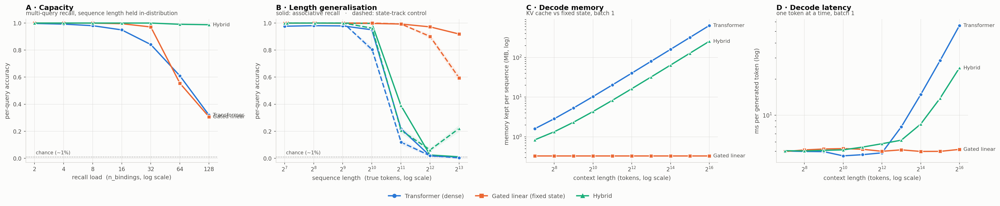

# iota run `r06`

- **updated:** 2026-10-07 00:44 UTC (last stage: `eval 8`)
- **code:** `4101680` on `claude/wonderful-ritchie-hbm5zn`
- **device:** Tesla T4 · torch 2.10.0+cu128 · Kaggle Batch

## 1. Training (best checkpoint, full-difficulty held-out set)

| model | best step | balanced | assoc (per-query) | state (control) | exact | lr | verdict |
|---|---:|---:|---:|---:|---:|---:|---|
| transformer | 12500 | 0.901 | 0.802 | 1.000 | 0.602 | 0.0015 | ok |
| gated_linear | 12500 | 0.977 | 0.955 | 1.000 | 0.830 | 0.0015 | ok |
| hybrid | 6000 | 1.000 | 1.000 | 1.000 | 1.000 | 0.00075 | ok |

Healthy = assoc high **and** state well above chance (~0.01). Full per-eval curves are in `logs/train.log` and the `*_sweep.json` files.

## 1b. Sanity gate — each model on its own training distribution

| model | assoc per-query | assoc exact | state per-query | state exact | gate |
|---|---:|---:|---:|---:|---|
| hybrid | 1.000 | 0.998 | 1.000 | 1.000 | pass |
| transformer | 0.797 | 0.364 | 1.000 | 1.000 | pass |
| gated_linear | 0.946 | 0.728 | 1.000 | 1.000 | pass |

n=500 per mode. Both per-query columns must be well above chance (~0.01) before any sweep number means anything.

## 2. Pass 1 — capacity (the headline)

Per-query accuracy [95% CI], exact-all-queries in parentheses. n=1000 per cell, paired prompts.

| n_bindings | true tokens | transformer | gated_linear | hybrid |
|---:|---:|---|---|---|
| 2 | 256 | 0.997 [0.99–1.00] (0.99) | 1.000 [1.00–1.00] (1.00) | 1.000 [1.00–1.00] (1.00) |
| 4 | 256 | 0.992 [0.99–0.99] (0.97) | 0.999 [1.00–1.00] (1.00) | 1.000 [1.00–1.00] (1.00) |
| 8 | 256 | 0.981 [0.98–0.98] (0.85) | 0.999 [1.00–1.00] (0.99) | 1.000 [1.00–1.00] (1.00) |
| 16 | 256 | 0.949 [0.95–0.95] (0.42) | 0.995 [0.99–1.00] (0.93) | 1.000 [1.00–1.00] (1.00) |
| 32 | 289 | 0.841 [0.84–0.85] (0.05) | 0.971 [0.97–0.97] (0.63) | 1.000 [1.00–1.00] (1.00) |
| 64 | 386 | 0.610 [0.60–0.62] (0.00) | 0.555 [0.55–0.56] (0.00) | 0.991 [0.99–0.99] (0.86) |
| 128 | 773 | 0.320 [0.31–0.33] (0.00) | 0.307 [0.30–0.31] (0.00) | 0.988 [0.99–0.99] (0.82) |

## 3. Pass 2 — length generalisation

Per-query accuracy [95% CI], exact-all-queries in parentheses. n=1000 per cell, paired prompts.

| seq_len | true tokens | transformer | gated_linear | hybrid |
|---:|---:|---|---|---|
| 128 | 128 | 0.977 [0.97–0.98] (0.83) | 0.999 [1.00–1.00] (0.99) | 1.000 [1.00–1.00] (1.00) |
| 256 | 256 | 0.981 [0.98–0.98] (0.86) | 1.000 [1.00–1.00] (1.00) | 1.000 [1.00–1.00] (1.00) |
| 512 | 512 | 0.979 [0.98–0.98] (0.85) | 0.998 [1.00–1.00] (0.99) | 1.000 [1.00–1.00] (1.00) |
| 1024 | 1024 | 0.950 [0.95–0.96] (0.68) | 0.997 [1.00–1.00] (0.98) | 0.998 [1.00–1.00] (0.98) |
| 2048 | 2048 | 0.219 [0.21–0.23] (0.00) | 0.993 [0.99–0.99] (0.94) | 0.390 [0.38–0.40] (0.00) |
| 4096 | 4096 | 0.019 [0.02–0.02] (0.00) | 0.972 [0.97–0.98] (0.79) | 0.025 [0.02–0.03] (0.00) |
| 8192 | 8192 | 0.009 [0.01–0.01] (0.00) | 0.919 [0.91–0.93] (0.50) | 0.011 [0.01–0.01] (0.00) |

## 4. Pass 3 — state_track control

Per-query accuracy [95% CI], exact-all-queries in parentheses. n=1000 per cell, paired prompts.

| seq_len | true tokens | transformer | gated_linear | hybrid |
|---:|---:|---|---|---|
| 128 | 136 | 1.000 [1.00–1.00] (1.00) | 1.000 [1.00–1.00] (1.00) | 1.000 [1.00–1.00] (1.00) |
| 256 | 264 | 1.000 [1.00–1.00] (1.00) | 1.000 [1.00–1.00] (1.00) | 1.000 [1.00–1.00] (1.00) |
| 512 | 520 | 1.000 [1.00–1.00] (1.00) | 1.000 [1.00–1.00] (1.00) | 1.000 [1.00–1.00] (1.00) |
| 1024 | 1032 | 0.803 [0.78–0.83] (0.80) | 1.000 [1.00–1.00] (1.00) | 0.962 [0.95–0.97] (0.96) |
| 2048 | 2056 | 0.119 [0.10–0.14] (0.12) | 0.993 [0.99–1.00] (0.99) | 0.206 [0.18–0.23] (0.21) |
| 4096 | 4104 | 0.019 [0.01–0.03] (0.02) | 0.901 [0.88–0.92] (0.90) | 0.062 [0.05–0.08] (0.06) |
| 8192 | 8200 | 0.003 [0.00–0.01] (0.00) | 0.594 [0.56–0.62] (0.59) | 0.221 [0.20–0.25] (0.22) |

## 4b. Diagnostic — recall by key length (digits), same prompts as Pass 1

| n_bindings | key digits | transformer | gated_linear | hybrid |
|---:|---:|---:|---:|---:|
| 16 | 1 | 0.951 | 0.995 | 1.000 |
| 16 | 2 | 0.953 | 0.996 | 1.000 |
| 16 | 3 | 0.936 | 0.994 | 1.000 |
| 32 | 1 | 0.873 | 0.990 | 0.999 |
| 32 | 2 | 0.847 | 0.972 | 1.000 |
| 32 | 3 | 0.810 | 0.963 | 1.000 |
| 64 | 1 | 0.649 | 0.740 | 0.987 |
| 64 | 2 | 0.626 | 0.563 | 0.990 |
| 64 | 3 | 0.545 | 0.466 | 0.996 |

If one model's errors pile up on 3-digit keys, its drop with load is partly key resolution, not memory capacity.

## 4c. Joint load × distance grid (8 queries per cell; true length held per column)

**transformer** — per-query recall

| bindings \ tokens | 1024 | 2048 | 4096 | 8192 |
|---:|---:|---:|---:|---:|
| 8 | 0.948 | 0.219 | 0.022 | 0.010 |
| 32 | 0.732 | 0.111 | 0.013 | 0.014 |
| 64 | 0.508 | 0.073 | 0.013 | 0.011 |
| 128 | 0.289 | 0.065 | 0.013 | 0.011 |

**gated_linear** — per-query recall

| bindings \ tokens | 1024 | 2048 | 4096 | 8192 |
|---:|---:|---:|---:|---:|
| 8 | 0.999 | 0.994 | 0.971 | 0.928 |
| 32 | 0.968 | 0.969 | 0.944 | 0.881 |
| 64 | 0.857 | 0.839 | 0.802 | 0.746 |
| 128 | 0.541 | 0.547 | 0.505 | 0.474 |

**hybrid** — per-query recall

| bindings \ tokens | 1024 | 2048 | 4096 | 8192 |
|---:|---:|---:|---:|---:|
| 8 | 0.997 | 0.386 | 0.024 | 0.013 |
| 32 | 0.969 | 0.194 | 0.015 | 0.009 |
| 64 | 0.856 | 0.167 | 0.009 | 0.010 |
| 128 | 0.847 | 0.257 | 0.009 | 0.009 |

## 4d. Free-running vs teacher-forced (Pass 1 prompts)

Per-query recall: teacher-forced → free-running (queries whose verdict changed).

| n_bindings | transformer | gated_linear | hybrid |
|---:|---|---|---|
| 2 | 0.998 → 0.996 (2) | 1.000 → 1.000 (0) | 1.000 → 1.000 (0) |
| 4 | 0.993 → 0.986 (14) | 0.999 → 0.999 (0) | 1.000 → 1.000 (0) |
| 8 | 0.980 → 0.962 (70) | 1.000 → 1.000 (0) | 1.000 → 1.000 (0) |
| 16 | 0.951 → 0.914 (329) | 0.995 → 0.994 (7) | 1.000 → 1.000 (0) |
| 32 | 0.844 → 0.811 (402) | 0.971 → 0.969 (24) | 1.000 → 1.000 (0) |
| 64 | 0.611 → 0.589 (588) | 0.552 → 0.551 (367) | 0.991 → 0.991 (0) |
| 128 | 0.314 → 0.306 (650) | 0.306 → 0.303 (330) | 0.988 → 0.988 (2) |

## 4e. Matched histories (Pass 7): does answering earlier questions change later recall?

Same facts, same final question at the same position; only the history differs. Final-query accuracy; Δ = condition − oracle (paired, 95% CI over items).

| model | bindings | prior Qs | none / oracle | neutral (Δ) | generated (Δ) | reordered (Δ) |
|---|---:|---:|---:|---|---|---|
| transformer | 8 | 0 | 0.958 | – | – | – |
| transformer | 8 | 3 | 0.976 | 0.954 (-0.022 [-0.04, -0.01]) | 0.964 (-0.012 [-0.02, -0.00]) | 0.978 (+0.002 [0.00, 0.01]) |
| transformer | 8 | 7 | 0.998 | 0.968 (-0.030 [-0.05, -0.01]) | 0.956 (-0.042 [-0.06, -0.03]) | 0.998 (+0.000 [0.00, 0.00]) |
| transformer | 32 | 0 | 0.800 | – | – | – |
| transformer | 32 | 3 | 0.814 | 0.792 (-0.022 [-0.04, -0.00]) | 0.798 (-0.016 [-0.03, -0.00]) | 0.814 (+0.000 [-0.01, 0.01]) |
| transformer | 32 | 7 | 0.872 | 0.838 (-0.034 [-0.06, -0.01]) | 0.842 (-0.030 [-0.05, -0.01]) | 0.872 (+0.000 [-0.01, 0.01]) |
| transformer | 32 | 15 | 0.906 | 0.804 (-0.102 [-0.13, -0.07]) | 0.856 (-0.050 [-0.07, -0.03]) | 0.908 (+0.002 [-0.01, 0.01]) |
| transformer | 64 | 0 | 0.634 | – | – | – |
| transformer | 64 | 3 | 0.630 | 0.618 (-0.012 [-0.03, 0.01]) | 0.614 (-0.016 [-0.03, -0.00]) | 0.630 (+0.000 [-0.01, 0.01]) |
| transformer | 64 | 7 | 0.600 | 0.604 (+0.004 [-0.02, 0.03]) | 0.584 (-0.016 [-0.04, 0.01]) | 0.602 (+0.002 [-0.01, 0.01]) |
| transformer | 64 | 15 | 0.624 | 0.596 (-0.028 [-0.06, 0.01]) | 0.574 (-0.050 [-0.08, -0.02]) | 0.618 (-0.006 [-0.02, 0.01]) |
| gated_linear | 8 | 0 | 1.000 | – | – | – |
| gated_linear | 8 | 3 | 0.994 | 0.996 (+0.002 [0.00, 0.01]) | 0.994 (+0.000 [0.00, 0.00]) | 0.994 (+0.000 [0.00, 0.00]) |
| gated_linear | 8 | 7 | 1.000 | 0.998 (-0.002 [-0.01, 0.00]) | 1.000 (+0.000 [0.00, 0.00]) | 1.000 (+0.000 [0.00, 0.00]) |
| gated_linear | 32 | 0 | 0.960 | – | – | – |
| gated_linear | 32 | 3 | 0.972 | 0.966 (-0.006 [-0.02, 0.00]) | 0.970 (-0.002 [-0.01, 0.00]) | 0.972 (+0.000 [0.00, 0.00]) |
| gated_linear | 32 | 7 | 0.976 | 0.966 (-0.010 [-0.02, 0.00]) | 0.976 (+0.000 [0.00, 0.00]) | 0.976 (+0.000 [-0.01, 0.01]) |
| gated_linear | 32 | 15 | 0.978 | 0.966 (-0.012 [-0.02, 0.00]) | 0.972 (-0.006 [-0.02, 0.00]) | 0.980 (+0.002 [-0.00, 0.01]) |
| gated_linear | 64 | 0 | 0.828 | – | – | – |
| gated_linear | 64 | 3 | 0.848 | 0.854 (+0.006 [-0.00, 0.02]) | 0.846 (-0.002 [-0.01, 0.00]) | 0.844 (-0.004 [-0.01, 0.00]) |
| gated_linear | 64 | 7 | 0.852 | 0.852 (+0.000 [-0.02, 0.02]) | 0.840 (-0.012 [-0.03, 0.00]) | 0.854 (+0.002 [-0.00, 0.01]) |
| gated_linear | 64 | 15 | 0.860 | 0.852 (-0.008 [-0.02, 0.01]) | 0.858 (-0.002 [-0.01, 0.01]) | 0.858 (-0.002 [-0.01, 0.01]) |
| hybrid | 8 | 0 | 1.000 | – | – | – |
| hybrid | 8 | 3 | 1.000 | 1.000 (+0.000 [0.00, 0.00]) | 1.000 (+0.000 [0.00, 0.00]) | 1.000 (+0.000 [0.00, 0.00]) |
| hybrid | 8 | 7 | 1.000 | 1.000 (+0.000 [0.00, 0.00]) | 1.000 (+0.000 [0.00, 0.00]) | 1.000 (+0.000 [0.00, 0.00]) |
| hybrid | 32 | 0 | 1.000 | – | – | – |
| hybrid | 32 | 3 | 1.000 | 1.000 (+0.000 [0.00, 0.00]) | 1.000 (+0.000 [0.00, 0.00]) | 1.000 (+0.000 [0.00, 0.00]) |
| hybrid | 32 | 7 | 1.000 | 1.000 (+0.000 [0.00, 0.00]) | 1.000 (+0.000 [0.00, 0.00]) | 1.000 (+0.000 [0.00, 0.00]) |
| hybrid | 32 | 15 | 1.000 | 1.000 (+0.000 [0.00, 0.00]) | 1.000 (+0.000 [0.00, 0.00]) | 1.000 (+0.000 [0.00, 0.00]) |
| hybrid | 64 | 0 | 1.000 | – | – | – |
| hybrid | 64 | 3 | 1.000 | 1.000 (+0.000 [0.00, 0.00]) | 1.000 (+0.000 [0.00, 0.00]) | 1.000 (+0.000 [0.00, 0.00]) |
| hybrid | 64 | 7 | 1.000 | 1.000 (+0.000 [0.00, 0.00]) | 1.000 (+0.000 [0.00, 0.00]) | 1.000 (+0.000 [0.00, 0.00]) |
| hybrid | 64 | 15 | 1.000 | 1.000 (+0.000 [0.00, 0.00]) | 1.000 (+0.000 [0.00, 0.00]) | 1.000 (+0.000 [0.00, 0.00]) |

Positive neutral Δ = the correctly answered history HURTS the final recall relative to equally long filler.

## 4f. Decay gates (Pass 8): what γ does on real prompts

Mean γ ± std over tokens × heads, by token role. `retention` = mean log10 of the share of a fact value's write still in the state at the first question. A frozen gate has std ≈ 0; selective forgetting shows as γ(distractor) < γ(fact value).

| model | bindings | layer | fact value | distractor | query | answer | retention (log10) | gate bias / ‖W‖ |
|---|---:|---|---|---|---|---|---:|---|
| gated_linear | 8 | backbone.blocks.0.mixer | 0.445 ± 0.348 | 0.147 ± 0.103 | 0.233 ± 0.243 | 0.453 ± 0.338 | -214.986 | -0.07 / 1.342 |
| gated_linear | 8 | backbone.blocks.1.mixer | 0.912 ± 0.175 | 0.767 ± 0.239 | 0.861 ± 0.242 | 0.913 ± 0.173 | -30.494 | +0.46 / 4.451 |
| gated_linear | 8 | backbone.blocks.2.mixer | 1.000 ± 0.001 | 1.000 ± 0.001 | 0.998 ± 0.006 | 1.000 ± 0.001 | -0.04 | +0.19 / 2.289 |
| gated_linear | 8 | backbone.blocks.3.mixer | 1.000 ± 0.000 | 1.000 ± 0.000 | 1.000 ± 0.000 | 1.000 ± 0.000 | -0.0 | +0.29 / 3.046 |
| gated_linear | 8 | backbone.blocks.4.mixer | 1.000 ± 0.001 | 1.000 ± 0.000 | 0.999 ± 0.004 | 0.999 ± 0.014 | -0.002 | +0.11 / 2.545 |
| gated_linear | 32 | backbone.blocks.0.mixer | 0.446 ± 0.349 | 0.148 ± 0.104 | 0.232 ± 0.243 | 0.454 ± 0.338 | -165.499 | -0.07 / 1.342 |
| gated_linear | 32 | backbone.blocks.1.mixer | 0.912 ± 0.176 | 0.769 ± 0.238 | 0.862 ± 0.242 | 0.912 ± 0.174 | -20.734 | +0.46 / 4.451 |
| gated_linear | 32 | backbone.blocks.2.mixer | 1.000 ± 0.001 | 1.000 ± 0.001 | 0.999 ± 0.004 | 1.000 ± 0.001 | -0.033 | +0.19 / 2.289 |
| gated_linear | 32 | backbone.blocks.3.mixer | 1.000 ± 0.000 | 1.000 ± 0.000 | 1.000 ± 0.000 | 1.000 ± 0.000 | -0.0 | +0.29 / 3.046 |
| gated_linear | 32 | backbone.blocks.4.mixer | 1.000 ± 0.001 | 1.000 ± 0.000 | 1.000 ± 0.003 | 0.999 ± 0.009 | -0.004 | +0.11 / 2.545 |
| hybrid | 8 | backbone.blocks.0.mixer | 0.257 ± 0.227 | 0.189 ± 0.121 | 0.149 ± 0.171 | 0.256 ± 0.230 | -188.346 | -0.09 / 0.913 |
| hybrid | 8 | backbone.blocks.1.mixer | 0.503 ± 0.356 | 0.933 ± 0.127 | 0.816 ± 0.284 | 0.755 ± 0.310 | -27.817 | +0.02 / 1.364 |
| hybrid | 8 | backbone.blocks.3.mixer | 0.628 ± 0.359 | 0.613 ± 0.340 | 0.621 ± 0.356 | 0.626 ± 0.354 | -99.718 | +0.01 / 0.966 |
| hybrid | 32 | backbone.blocks.0.mixer | 0.258 ± 0.227 | 0.189 ± 0.121 | 0.149 ± 0.170 | 0.257 ± 0.230 | -162.239 | -0.09 / 0.913 |
| hybrid | 32 | backbone.blocks.1.mixer | 0.501 ± 0.355 | 0.926 ± 0.144 | 0.810 ± 0.290 | 0.755 ± 0.309 | -92.596 | +0.02 / 1.364 |
| hybrid | 32 | backbone.blocks.3.mixer | 0.629 ± 0.359 | 0.614 ± 0.340 | 0.621 ± 0.357 | 0.625 ± 0.354 | -85.423 | +0.01 / 0.966 |

## 5. Prefill cost (one forward pass, batch 1; mostly kernel quality)

Peak VRAM MB / median latency ms.

| seq_len | transformer | gated_linear | hybrid |
|---:|---|---|---|
| 128 | 20.7 MB / 4.61 ms | 21.0 MB / 11.10 ms | 21.1 MB / 8.27 ms |
| 256 | 22.1 MB / 5.05 ms | 22.1 MB / 16.37 ms | 22.3 MB / 11.71 ms |
| 512 | 24.9 MB / 5.05 ms | 24.4 MB / 28.51 ms | 24.6 MB / 19.39 ms |
| 1024 | 30.6 MB / 8.53 ms | 28.9 MB / 51.40 ms | 29.8 MB / 33.17 ms |
| 2048 | 41.8 MB / 16.66 ms | 38.0 MB / 96.00 ms | 40.3 MB / 64.08 ms |
| 4096 | 64.3 MB / 30.28 ms | 56.0 MB / 189.25 ms | 61.3 MB / 123.68 ms |
| 8192 | 109.3 MB / 92.03 ms | 92.2 MB / 380.95 ms | 103.4 MB / 246.32 ms |

## 5b. Decode cost (one token at a time, batch 1)

Memory each model keeps per sequence (exact cache/state size) / median ms per token.

| context | transformer | gated_linear | hybrid |
|---:|---|---|---|
| 128 | 1.61 MB / 5.03 ms | 0.33 MB / 4.99 ms | 0.84 MB / 5.07 ms |
| 256 | 2.86 MB / 5.00 ms | 0.33 MB / 5.14 ms | 1.34 MB / 5.05 ms |
| 512 | 5.36 MB / 4.98 ms | 0.33 MB / 5.24 ms | 2.34 MB / 5.10 ms |
| 1024 | 10.36 MB / 4.59 ms | 0.33 MB / 5.28 ms | 4.34 MB / 5.15 ms |
| 2048 | 20.36 MB / 4.70 ms | 0.33 MB / 5.21 ms | 8.34 MB / 5.43 ms |
| 4096 | 40.36 MB / 4.86 ms | 0.33 MB / 5.01 ms | 16.34 MB / 5.79 ms |
| 8192 | 80.36 MB / 8.01 ms | 0.33 MB / 5.15 ms | 32.34 MB / 6.20 ms |
| 16384 | 160.36 MB / 14.87 ms | 0.33 MB / 5.00 ms | 64.34 MB / 8.44 ms |
| 32768 | 320.36 MB / 28.55 ms | 0.33 MB / 5.00 ms | 128.34 MB / 13.85 ms |
| 65536 | 640.36 MB / 55.91 ms | 0.33 MB / 5.20 ms | 256.34 MB / 24.84 ms |

## 6. Figure

